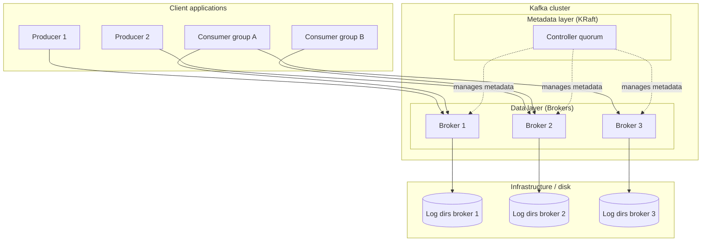
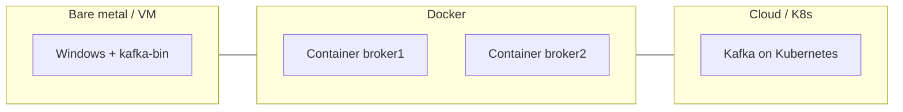
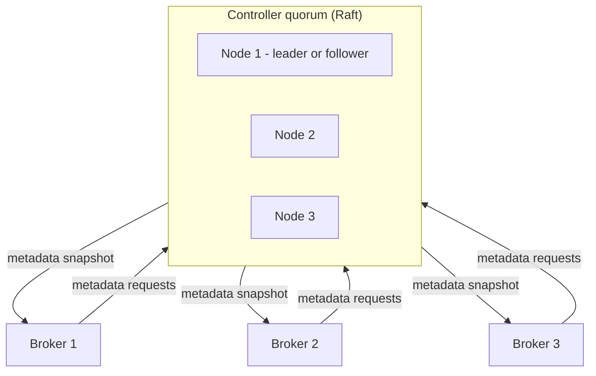
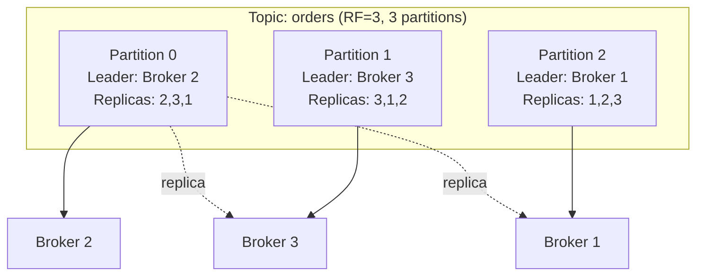
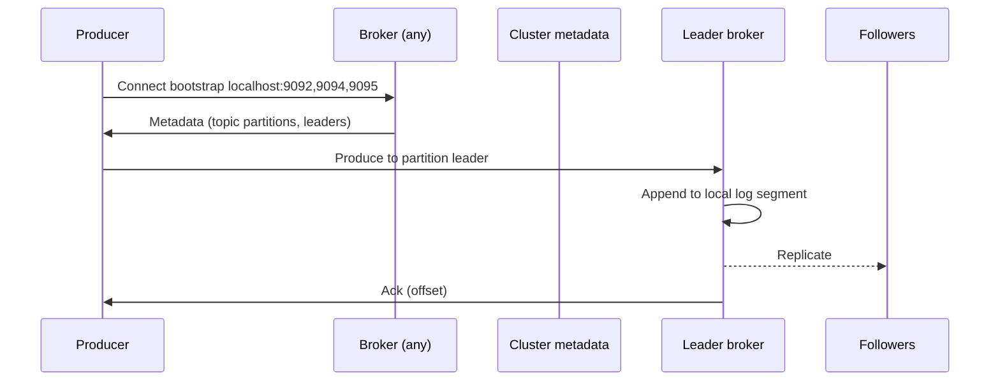
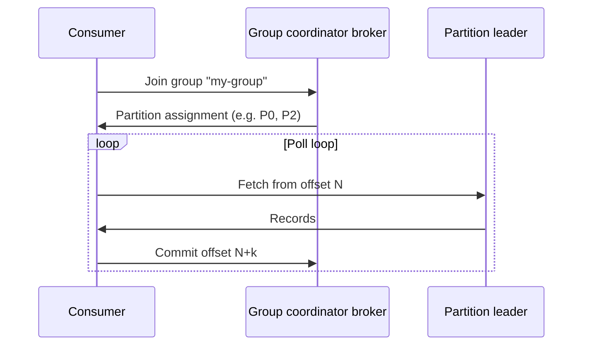
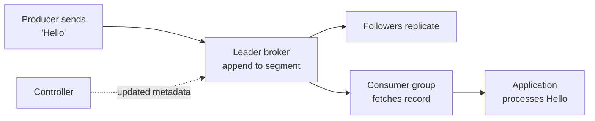

# Apache Kafka - Full Architecture Guide (Infrastructure & Concepts)

A end-to-end reference for how Kafka works under the hood: hardware, network, processes, storage, and client flow. Aligned with your **Day-2 labs** (local Windows, multi-broker, Docker).

**Your lab docs:**

| Lab | Document |
|-----|----------|
| Single broker (KRaft) | [kafka-kraft-setup-windows.md](./kafka-kraft-setup-windows.md) |
| Multi-broker CLI (kafka-bin) | [muti-broker/kafka-multi-broker-cli-lab.md](./muti-broker/kafka-multi-broker-cli-lab.md) |
| Multi-broker combined configs | [kafka-local-3brokers/CONFIG-EXPLAINED.md](./kafka-local-3brokers/CONFIG-EXPLAINED.md) |
| Docker single broker | [kafka-docker-lab-guide.md](./kafka-docker-lab-guide.md) |
| Docker 3 brokers | [muti-broker/kafka-multi-broker-cli-lab.md](./muti-broker/kafka-multi-broker-cli-lab.md) (Docker section) |

---

## Table of contents

1. [What Kafka is](#1-what-kafka-is)
2. [High-level architecture](#2-high-level-architecture)
3. [Infrastructure layer](#3-infrastructure-layer)
4. [Kafka cluster components](#4-kafka-cluster-components)
5. [KRaft metadata layer](#5-kraft-metadata-layer)
6. [Topics, partitions, and replicas](#6-topics-partitions-and-replicas)
7. [Producer path (publish)](#7-producer-path-publish)
8. [Consumer path (subscribe)](#8-consumer-path-subscribe)
9. [Storage on disk](#9-storage-on-disk)
10. [Network and ports](#10-network-and-ports)
11. [Your lab topologies](#11-your-lab-topologies)
12. [Reliability and scaling](#12-reliability-and-scaling)
13. [Operations checklist](#13-operations-checklist)
14. [Glossary](#14-glossary)

---

## 1. What Kafka is

Apache Kafka is a **distributed event streaming platform**. In practice it acts as:

- A **durable message log** (messages are persisted, not only kept in memory).
- A **pub/sub system** (many producers write; many consumer groups read).
- A **clustered service** (multiple servers cooperate for capacity and fault tolerance).

**Not** a traditional queue where one message is consumed once globally - unless you design consumer groups that way. Multiple independent consumer groups can each read the full stream.

---

## 2. High-level architecture



### Explanation

| Layer | Responsibility |
|-------|----------------|
| **Producers** | Send records (key, value, headers, timestamp) to a **topic**. |
| **Brokers** | Store partitions on disk; serve produce/fetch requests. |
| **Controller quorum (KRaft)** | Tracks cluster metadata: brokers, topics, partitions, leaders, ACLs. |
| **Consumers** | Read from assigned partitions; commit offsets. |
| **Disk** | Source of truth for messages (log segments). |

---

## 3. Infrastructure layer

Kafka runs on **servers** (physical, VM, or container). Infrastructure decisions affect performance and reliability.

### 3.1 Compute (CPU & RAM)

| Component | CPU | RAM |
|-----------|-----|-----|
| **Broker** | Compression, TLS, replication, request handling | Heap for page cache coordination; OS cache is critical |
| **Controller** | Metadata updates, leader election | Smaller than brokers in large clusters |
| **Client** | Serialization | Buffers for batching |

**Lab (your PC):** 3 local brokers = 3 JVM processes. Each may use ~512MB–1GB heap (`KAFKA_HEAP_OPTS` in `kafka-server-start.bat`). Ensure enough RAM for OS + 3–4 Java processes.

### 3.2 Disk (most important for brokers)

| Aspect | Detail |
|--------|--------|
| **Type** | SSD/NVMe preferred for production; HDD works for labs |
| **Layout** | `log.dirs` - one or more directories per broker |
| **Your paths** | `C:/kafka-data/kraft-broker-logs-1`, `multi-broker-1`, etc. |
| **I/O pattern** | Sequential writes (append-only log); periodic reads |

Kafka performance depends heavily on **OS page cache**, not only JVM heap.

### 3.3 Network

| Traffic type | Typical ports (your labs) |
|--------------|-------------------------|
| **Client → broker** | 9092, 9094, 9095 (PLAINTEXT) |
| **Broker ↔ broker** | Same listener or internal PLAINTEXT (inter-broker) |
| **KRaft controller** | 9093, 9193, 9293 (not for app clients) |
| **Docker** | Host port maps to container (e.g. 9092:9092) |

Firewall rules must allow:

- Clients → all broker client ports.
- Brokers → each other (replication).
- Brokers → controller(s).

### 3.4 Deployment models



| Model | Your lab | Pros | Cons |
|-------|----------|------|------|
| **Local install** | `C:\kafka-bin\...` | Full control, matches docs | Manual ports, JVM on host |
| **Docker** | `kafka-docker/` | Fast reset, isolated | Port mapping, resource limits |
| **Kubernetes** | (not in labs) | Production standard | More moving parts |

---

## 4. Kafka cluster components

### 4.1 Broker

A **broker** is a Kafka server process that:

- Accepts **produce** requests (writes).
- Accepts **fetch** requests (reads).
- Replicates partition data to other brokers.
- Reports health to the metadata layer.

**Config (your muti-broker lab):** `process.roles=broker`, `listeners=PLAINTEXT://localhost:9092`, `log.dirs=...`

### 4.2 Controller (KRaft)

The **controller** manages **metadata** - not the main copy of user topic data.

Responsibilities:

- Create/delete topics.
- Assign partition **leaders** and **replicas**.
- Handle broker join/leave.
- Propagate metadata to brokers.

**Modern Kafka (3.3+):** uses **KRaft** (Kafka Raft Metadata mode). ZooKeeper is deprecated.

**Your split lab:** dedicated `controller.properties` on port **9093**.  
**Your combined lab:** controller role inside each `brokerN.properties` on ports 9093/9193/9293.

### 4.3 ZooKeeper (legacy - know for interviews)

Older clusters stored metadata in **ZooKeeper**. New installs use **KRaft only**. Your Kafka **4.2** labs are KRaft-based.

### 4.4 Producer

Application (or CLI) that sends messages.

- Chooses partition (key hash, sticky partitioner, or explicit).
- Batches records for throughput.
- Waits for acknowledgment (`acks=0|1|all`).

**Lab:** `kafka-console-producer.bat --bootstrap-server ... --topic ...`

### 4.5 Consumer

Application (or CLI) that reads messages.

- Joins a **consumer group** (or uses assign for manual assignment).
- Gets partition assignments from the **group coordinator**.
- Commits **offsets** (position in log).

**Lab:** `kafka-console-consumer.bat ... --group ...`

### 4.6 Topic

A **named stream** of records. Logical category (e.g. `orders`, `lab-messages`).

- Split into **partitions** for parallelism.
- Configured with retention, compression, replication.

---

## 5. KRaft metadata layer



### Key ideas

| Concept | Explanation |
|---------|-------------|
| **Raft consensus** | Controllers agree on an ordered log of metadata changes. One **leader**, others **followers**. |
| **Metadata log** | Topics, partitions, ISR, broker registrations - not your `hello` messages. |
| **Quorum voters** | Static list: `1@localhost:9093,2@localhost:9193,3@localhost:9293` (combined lab). |
| **Bootstrap servers** | Brokers discover controllers: `controller.quorum.bootstrap.servers=localhost:9093` (split lab). |

### Format / storage (infra)

Before first start, **`kafka-storage.bat format`** initializes:

- `meta.properties` (cluster id, node id, directory id)
- Metadata log directory under `log.dirs`

**Your commands:**

- Controller only: `--standalone`
- Brokers joining: `--no-initial-controllers`
- Three combined nodes: `--initial-controllers "1@host:port:dirId,..."`

---

## 6. Topics, partitions, and replicas



### Partition

- Ordered, immutable sequence of records.
- Each record has **offset** (0, 1, 2, …).
- Parallelism unit: more partitions → more parallel consumers (up to a point).

### Replication factor (RF)

- **RF=3** → 3 brokers hold a copy of each partition.
- **Leader** handles all reads/writes for that partition.
- **Followers** replicate from leader.
- **ISR** (in-sync replicas) = replicas caught up enough.

### Leader election

If leader broker dies, controller elects a new leader from ISR.

**Lab command to see layout:**

```bat
bin\windows\kafka-topics.bat --bootstrap-server %BS% --describe --topic scenario2-topic
```

---

## 7. Producer path (publish)



### Step-by-step

1. **Bootstrap:** Producer connects to any broker in `bootstrap.servers`.
2. **Metadata refresh:** Learns which broker is **leader** for each partition.
3. **Partitioning:** Key → hash → partition; or round-robin / sticky.
4. **Send batch:** Records compressed (optional), sent to leader.
5. **Replication:** Leader waits for ISR (depends on `acks`).
6. **Response:** Offset returned to producer.

### `acks` (durability vs latency)

| acks | Meaning |
|------|---------|
| `0` | Fire-and-forget |
| `1` | Leader wrote |
| `all` / `-1` | All ISR replicas ack (safest) |

**Your Java lab** uses `acks=all`.

---

## 8. Consumer path (subscribe)



### Consumer group

| Behavior | Explanation |
|----------|-------------|
| **One group, many consumers** | Each partition assigned to **one** consumer in the group (load balancing). |
| **Many groups** | Each group reads **all** messages independently (fan-out). |
| **Offset commit** | Kafka stores progress in `__consumer_offsets` topic. |

**Lab Scenario 1A:** same group → messages split.  
**Lab Scenario 1B:** different groups → both get all messages.

### `auto.offset.reset`

| Value | When no committed offset |
|-------|---------------------------|
| `earliest` | Read from start of log |
| `latest` | Only new messages |

---

## 9. Storage on disk

### Directory layout (broker)

```text
log.dirs/   (e.g. C:/kafka-data/kraft-broker-logs-1)
  __consumer_offsets-0/     # internal
  __transaction_state-0/    # internal
  my-topic-0/               # partition 0 of my-topic
    00000000000000000000.log
    00000000000000000000.index
    00000000000000000000.timeindex
  my-topic-1/
  ...
```

| File | Purpose |
|------|---------|
| `.log` | Message data (append-only) |
| `.index` | Offset → file position |
| `.timeindex` | Timestamp → offset |

### Retention (infra impact)

- **Time:** `log.retention.hours` (default 168 = 7 days in your configs).
- **Size:** `log.retention.bytes` (optional cap).
- Old segments **deleted** when policy triggers - disk usage bounded.

### Controller log dirs

Separate folder (e.g. `C:/kafka-data/kraft-controller-logs`) stores **metadata**, not business topic payloads.

---

## 10. Network and ports

### Your muti-broker split topology (kafka-bin)

```text
                    ┌─────────────────────────┐
                    │  controller.properties   │
                    │  node.id=1               │
                    │  CONTROLLER :9093        │
                    └───────────┬─────────────┘
                                │
        ┌───────────────────────┼───────────────────────┐
        │                       │                       │
   ┌────▼────┐             ┌────▼────┐             ┌────▼────┐
   │ broker-1│             │ broker-2│             │ broker-3│
   │ id=2    │             │ id=3    │             │ id=4    │
   │ :9092   │             │ :9094   │             │ :9095   │
   └────┬────┘             └────┬────┘             └────┬────┘
        │                       │                       │
        └───────────────────────┼───────────────────────┘
                                │
                    Producers / Consumers
                    bootstrap: 9092,9094,9095
```

### Combined topology (kafka-local-3brokers)

Each of 3 JVMs runs **broker+controller** with its own client port and controller port (9092/9093, 9094/9193, 9095/9293).

### Docker topology

Host machine connects to `localhost:9092` (mapped into container). Inside Docker network, brokers use hostnames `broker1`, `broker2`, `broker3`.

---

## 11. Your lab topologies

### 11.1 Single broker (Day 1)

| Item | Value |
|------|--------|
| Config | `config\server.properties` |
| Roles | `broker,controller` on one JVM |
| Ports | 9092 (client), 9093 (controller) |
| Data | `C:/kafka-data/kraft-combined-logs` |
| Format | `--standalone` |

Good for: learning CLI, Java/Python/.NET clients.

### 11.2 Multi-broker split (muti-broker + kafka-bin)

| Process | Config | Port |
|---------|--------|------|
| Controller | `config\controller.properties` | 9093 |
| Broker 1 | `config\broker-1.properties` | 9092 |
| Broker 2 | `config\broker-2.properties` | 9094 |
| Broker 3 | `config\broker-3.properties` | 9095 |

Good for: realistic roles, replication RF=3, `--describe` shows leaders.

### 11.3 Multi-broker combined (kafka-local-3brokers)

| Process | Config | Client / Controller ports |
|---------|--------|----------------------------|
| Node 1 | `broker1.properties` | 9092 / 9093 |
| Node 2 | `broker2.properties` | 9094 / 9193 |
| Node 3 | `broker3.properties` | 9095 / 9293 |

Good for: understanding `controller.quorum.voters` and `--initial-controllers`.

### 11.4 Client labs (same infra target)

All connect to running brokers:

```text
localhost:9092[,localhost:9094,localhost:9095]
```

| Lab | Stack |
|-----|--------|
| Java | `kafka-java-lab` |
| Python | `kafka-python-lab` |
| .NET | `kafka-dotnet-lab` |

---

## 12. Reliability and scaling

### Fault tolerance

| Failure | Effect |
|---------|--------|
| **Broker down** | Partitions with replicas on other brokers stay available if ISR enough |
| **Controller down** | Remaining controllers in quorum continue (if RF>1); single controller lab stops metadata updates if only one |
| **Disk full** | Broker may stop accepting writes - monitor `log.dirs` |
| **Network partition** | Complex; min ISR and `acks=all` reduce data loss risk |

### Scaling dimensions

| Scale | How |
|-------|-----|
| **Throughput** | More partitions, more brokers, bigger batches |
| **Retention** | More disk, longer `retention.hours` |
| **Consumers** | More consumers in group (≤ partitions for balance) |
| **Availability** | Higher replication factor, multiple AZs/racks (`broker.rack`) |

---

## 13. Operations checklist

### Before starting cluster

- [ ] Ports free (9092–9095, 9093/9193/9293 for combined)
- [ ] `log.dirs` folders exist on fast disk
- [ ] `kafka-storage.bat format` done per node
- [ ] Same `cluster.id` for all nodes in one cluster
- [ ] Controller started before brokers (split model)

### Health checks

```bat
cd C:\kafka-bin\kafka_2.13-4.2.0
set BS=localhost:9092,localhost:9094,localhost:9095
bin\windows\kafka-broker-api-versions.bat --bootstrap-server %BS%
bin\windows\kafka-topics.bat --bootstrap-server %BS% --list
bin\windows\kafka-consumer-groups.bat --bootstrap-server %BS% --list
```

### Common infra mistakes

| Mistake | Symptom |
|---------|---------|
| Bootstrap uses controller port 9093 | Client connection errors |
| Duplicate `node.id` | Broker fails to start |
| RF=3 with only 2 brokers running | Topic create fails |
| Forgot format | `No readable meta.properties` |
| Two Kafka installs on same port | `Address already in use` |

---

## 14. Glossary

| Term | Definition |
|------|------------|
| **Broker** | Kafka server that stores and serves data |
| **Controller** | Manages cluster metadata (KRaft) |
| **Topic** | Named category of messages |
| **Partition** | Ordered sub-stream of a topic |
| **Offset** | Position in a partition log |
| **Replica** | Copy of a partition on a broker |
| **Leader** | Replica that handles reads/writes |
| **ISR** | Replicas sufficiently up to date |
| **RF** | Replication factor - number of replicas |
| **Consumer group** | Set of consumers sharing work |
| **Bootstrap servers** | Initial addresses for discovery |
| **KRaft** | Kafka’s built-in metadata quorum (no ZooKeeper) |
| **log.dirs** | Disk paths for broker data |
| **meta.properties** | Created by storage format; cluster identity |

---

## 15. End-to-end picture (one message)



1. **Infra:** JVM broker process running, disk mounted at `log.dirs`, port 9092 open.  
2. **Metadata:** Controller knows topic `lab-messages` has 3 partitions and which leaders.  
3. **Produce:** Producer sends to leader; message persisted and replicated.  
4. **Consume:** Consumer in group assigned partition; reads from offset; commits offset.  
5. **Retention:** After retention period, segment files deleted from disk.

---

## 16. Further reading (official)

- [Kafka documentation - introduction](https://kafka.apache.org/documentation/#introduction)
- [KRaft (metadata mode)](https://kafka.apache.org/documentation/#kraft)
- Your hands-on flow: [muti-broker/kafka-multi-broker-cli-lab.md](./muti-broker/kafka-multi-broker-cli-lab.md)

---

*Document version: aligned with Kafka 4.2 local labs, KRaft, Windows + Docker.*
