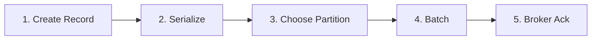

# Lab 02- Understanding Producer Workflow

**Objective:** Learn the end-to-end path of a message from your application to Kafka storage. No code required in this lab.

## Producer workflow (5 steps)



### Step 1- Producer creates a message

Your app builds a **ProducerRecord** (key, value, optional headers).

Example business payload:

```json
{
  "orderId": 101,
  "customer": "John",
  "amount": 2500
}
```

### Step 2- Serialization

Kafka stores **bytes**. Serializers convert objects/strings to bytes.

| Type | Typical serializer |
|------|-------------------|
| String | `StringSerializer` |
| JSON | Custom or schema-aware serializer |

### Step 3- Partition selection

| Scenario | Behavior |
|----------|----------|
| **No key** | Spread across partitions (sticky / round-robin per batch) |
| **With key** | `hash(key) % partitionCount` → same key → same partition |

**Why keys matter:** Order events for `customer-1` stay ordered on one partition.

### Step 4- Message batching

The producer **buffers** records and sends batches for:

- Higher throughput
- Fewer network round trips
- Better broker efficiency

Tuned in Lab 13 (`batch.size`, `linger.ms`).

### Step 5- Broker acknowledgment

The broker (and replicas, if configured) confirms receipt based on **`acks`**:

| `acks` | Guarantee |
|--------|-----------|
| `0` | Fire-and-forget |
| `1` | Leader wrote to log |
| `all` | All in-sync replicas acknowledged |

## Exercise (observation only)

1. Skim [Lab 03](../lab-03-java-basic-producer/README.md) code: find where serialization and `ProducerRecord` are set.
2. Note: partition is chosen **after** serialize, **before** send.

## Checkpoint questions

1. What happens if two messages use the same key?
2. Why batch messages instead of sending one TCP packet per record?
3. Which `acks` setting is safest for payments?

## Next lab

→ [Lab 03- Java Basic Producer](../lab-03-java-basic-producer/README.md)
