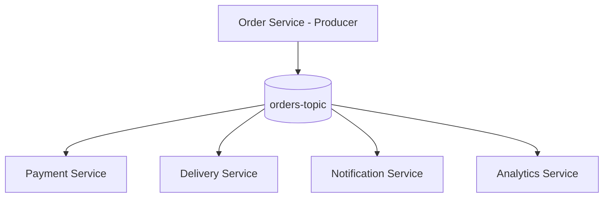

# Lab 15- Real-Time Industry Example

**Objective:** Map Kafka producers to a real **food delivery** architecture.

## Architecture



## Components

| Role | Technology | Kafka role |
|------|------------|------------|
| **Order Service** | Java / Spring | **Producer**- publishes `OrderCreated`, `OrderUpdated` |
| **Topic** | `orders-topic` | Durable event log |
| **Payment Service** | Consumer + maybe producer | Reacts to new orders |
| **Delivery Service** | Consumer | Assigns riders |
| **Notification Service** | Consumer | Push/SMS/email |
| **Analytics** | Kafka → Spark/Flink | Aggregations |

## Event design (ties to Lab 11)

```json
{
  "orderId": 1001,
  "customer": "Vikash",
  "amount": 4500,
  "payment": "UPI",
  "status": "CREATED"
}
```

- **Key:** `orderId` or `customerId` for partition affinity
- **Value:** JSON or Avro with schema

## Producer settings in production

| Setting | Recommendation |
|---------|----------------|
| `acks` | `all` |
| `enable.idempotence` | `true` |
| `compression.type` | `lz4` or `snappy` |
| Keys | `customerId` or `orderId` |

## Exercise

1. Run `JsonOrderProducer` and pretend you are the Order Service.
2. List which downstream service cares about which fields.
3. Draw what happens if Payment Service is down (Kafka retains messages; consumer catches up later).

## Course complete

You have covered:

- Producer API (Java + Python)
- Keys & partitions
- Acks, retries, idempotence
- JSON events & performance tuning
- Operations troubleshooting

Return to [Labs README](../README.md) for the full index.
