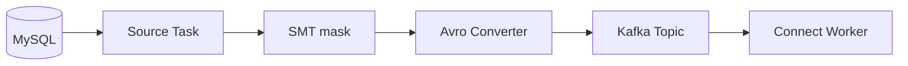

# Lab 01-Identify Connect Components

**Objective:** Map a connector configuration snippet to Connector, Task, Converter, SMT, and Worker.

From **Kafka_Connect_API.pptx**-Slide 8.

---

## Prerequisites

- Basic Kafka Connect concepts (slides 5–7)
- No cluster required (discussion lab)

---

## Given configuration

```properties
name=mysql-orders
connector.class=io.confluent.connect.jdbc.JdbcSourceConnector
tasks.max=3
value.converter=io.confluent.kafka.connect.avro.AvroConverter
transforms=mask
transforms.mask.type=org.apache.kafka.connect.transforms.MaskField$Value
```

---

## Step 1-Match each line

| Config key | Component | Your answer |
|------------|-----------|-------------|
| `connector.class=...JdbcSourceConnector` | **Connector**-defines integration type | |
| `tasks.max=3` | **Task parallelism**-up to 3 tasks | |
| `value.converter=AvroConverter` | **Converter**-serializes record values | |
| `transforms=mask` | **SMT chain** entry point | |
| `transforms.mask.type=MaskField$Value` | **SMT**-masks a field in the value | |
| (implicit) JVM process running Connect | **Worker** | |

---

## Step 2-Discussion questions

### Where does the Converter sit?

**Source path:** Source system → Source Task `poll()` → **Converter** → Kafka topic  
**Sink path:** Kafka topic → **Converter** → SMT → Sink Task `put()` → target system

Converters run **on the worker**, before records hit Kafka (source) or after read (sink).

### If `tasks.max=3` but only one table?

Typically **1 task** runs-JDBC source often splits by table/partition; one non-partitioned table = one task. Extra task slots stay unused unless the connector can split work (e.g. multiple tables in whitelist).

### Where to add a second SMT to drop a column?

```properties
transforms=mask,dropCol
transforms.dropCol.type=org.apache.kafka.connect.transforms.ReplaceField$Value
transforms.dropCol.exclude=internal_id
```

Order matters: transforms run left-to-right.

---

## Step 3-Draw the data path

Sketch (paper or mermaid):



---

## Checkpoint

- [ ] All five components identified correctly
- [ ] Can explain converter position in source vs sink path
- [ ] Can add a second SMT to the config chain

---

## Deliverable

One paragraph: what happens when the worker process dies in **distributed mode** vs **standalone mode** (slide 9).
